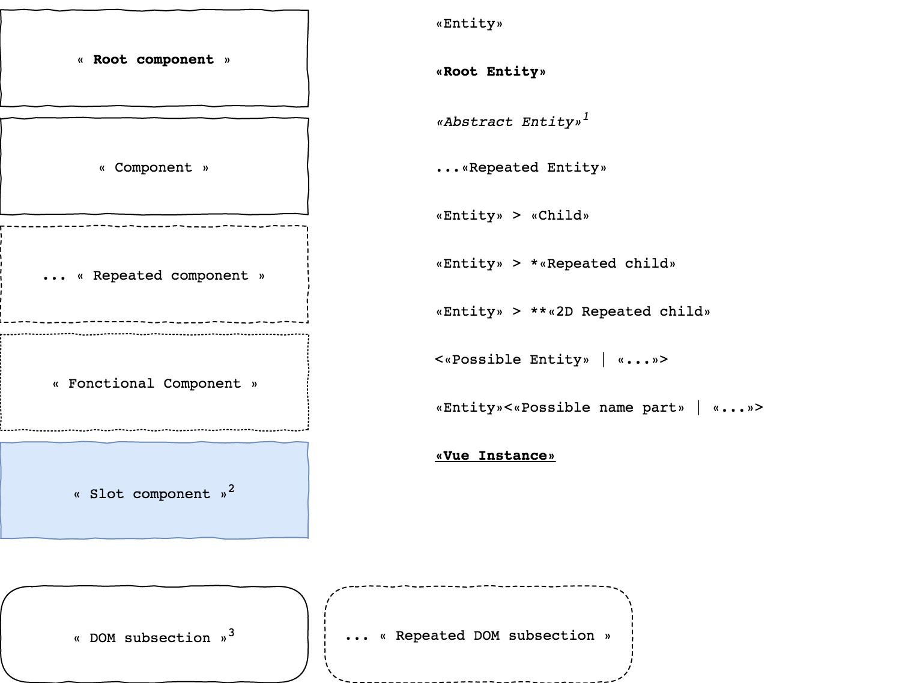
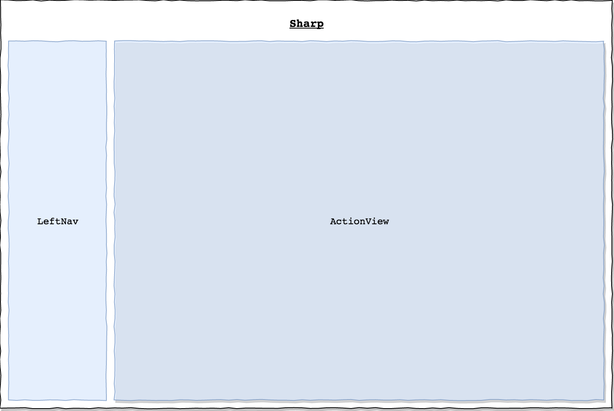
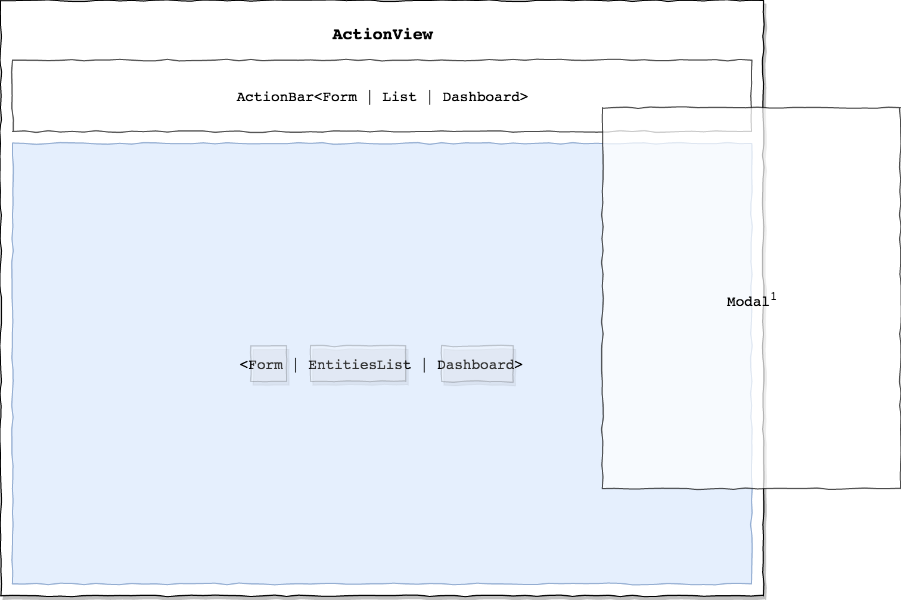
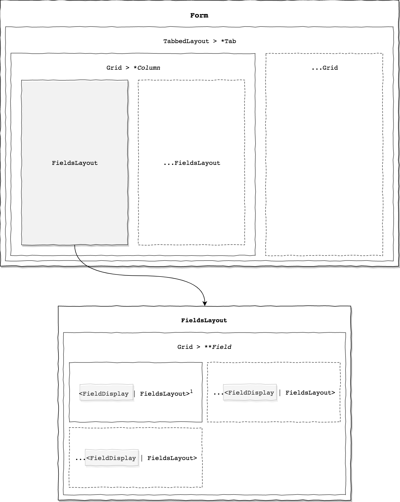
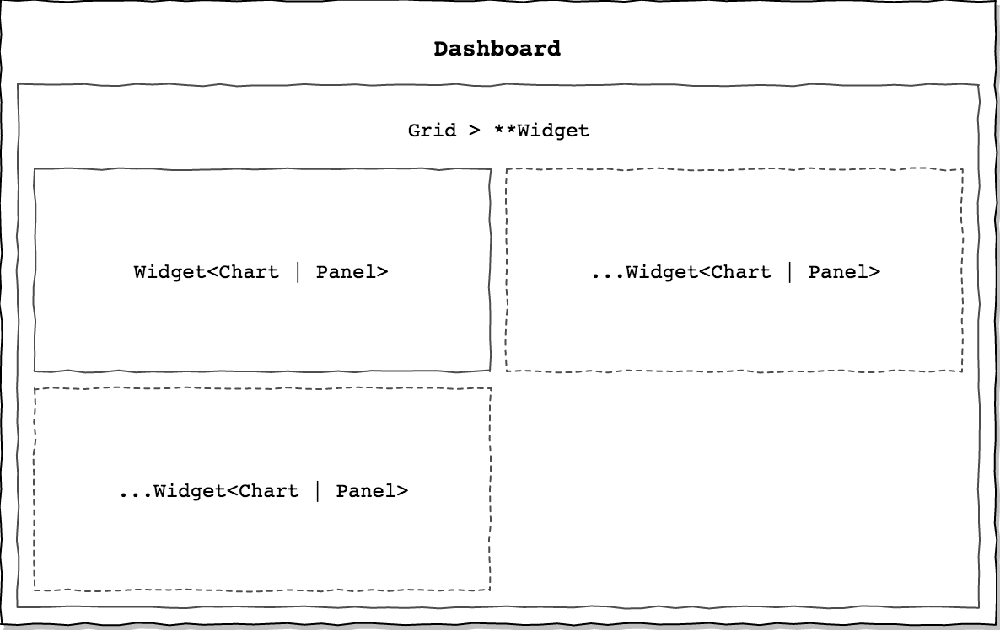

# Sharp Front-End Documentation

The front-end of Sharp 4 is made with the JS framework [Vue.js](https://vuejs.org/).

---
## How to read this document ?

### Diagrams

Diagrams in this document follows this convention :

1. An abstract entity isn't defined, it's purpose is to give a context to descendant entities (for the clarity of the diagram)
2. A slot component is explicitly written in a `.blade` file
3. A DOM subsection is a separation only visible in the page DOM not as a Vue component

---
## The root component

Components above are defined in each `.blade` Sharp pages :
* Dashboard
* Form
* EntitiesList

---
## Action view

1. The «main modal» can be called in every child components. To do so, emit the event showMainModal with the actionsBus. 
Used to show text/error message.

### Props
Prop name | Required | Description
-|-|-
`context` | `true` | Define in which page the component is : `"dashboard"`, `"form"` or `"list"`

---

## Form

1. If the field's layout define a fieldset, it display another FieldsLayout component corresponding of the fieldset layout. Else the FieldDisplay component is used

### Props
Prop name | Required | Type | Default | Description
-|-|-|-|-
`entity-key` | `false` | *String* | | The current form entity key (required to make a `CREATE` or `UPDATE` API call)
`instance-id` | `false` | *String* | | The current form entity key (required to make `UPDATE` API call)
`independant` | `false` | *Boolean* |`false` | If `true`, prevent the component setting up the *ActionBar*, also prevent making *API calls*
`ignore-authorizations` |  `false` | *Boolean*  | `false` | If `true`, ignoring all authorizations tests
`props` | `false` | *Object* | | If `independant`, mount the form with the given object
`reset-data-after-submitted` | `false` | *Boolean* | `false` | Reset data object after sucessful submission

### FieldDisplay

The *FieldDiplay* component :
* Decide if the Field is visible (it compute the given field's conditional display with the other context's fields)
* Gives the localized value to the field if locales are defined
* Gives the localized error identifier to the field if locales are defined

The *FieldContainer* component, as well as displaying the Field :
* Shows the field label
* Shows an error if the field has one
* Shows an help message if the field has one

The *Field* component:
* Chooses the correct component to display given the field type
* Defines exposed props to the field component
* Calls a function to update form data on input emitted

#### Props
Prop name | Required | Type | Description
-|-|-|-
`field-key` | `true` | `String` | String key describing the field (unique in the current context)
`context-fields` | `true` | `Object` | Object listing all fields in the current context (Form fields, List item fields...) : follow the fields object declaration format
`context-data` | `true` | `Object` | Object listing all fields data in the current context : follow the data object declaration format
`field-layout` | `true` | `Object` | Object specifying the current field layout, essentially used for the `List` field
`locale` | `false` | `String` | String representing the current selected locale
`error-identifier` | `true` | `String` | String which will be concatenate to the first *ErrorNode*'s parent `id` if exist : ex `name` concatenated to `list.0` give `list.0.name`. Used for laravel validation. *Fields* and *List items* are *ErrorNode*.
`update-data` | `true` | `Function` | Function called when a field changed to update the form data object

---

## EntitiesList

1. These modals instantiate each command forms. If the user click on a command with a form, the corresponding modal is displayed

### Props
Prop name | Required | Type | Description
-|-|-|-
`entity-key` | `true` | `String` | Entity key of the current list page

---

## Dashboard
 
