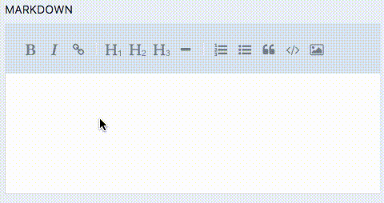

# Form field: Markdown

This form field is a markdown editor, with formatting and an optional toolbar.

Class: `Code16\Sharp\Form\Fields\SharpFormMarkdownField`

## Configuration

### `setHeight(int $height)`

Set the textarea height, in pixels.

### `showToolbar()` and `hideToolbar()`

Show or hide the toolbar (shown by default).

### `setToolbar(array $toolbar)`

Override the default toolbar, providing an array built with `SharpFormMarkdownField`'s constants:

    const B = "bold";
    const I = "italic";
    const UL = "unordered-list";
    const OL = "ordered-list";
    const SEPARATOR = "|";
    const A = "link";
    const H1 = "heading-1";
    const H2 = "heading-2";
    const H3 = "heading-3";
    const CODE = "code";
    const QUOTE = "quote";
    const IMG = "image"; // special, see below
    const HR = "horizontal-rule";

Example:

    SharpFormMarkdownField::make("description")
            ->setToolbar([
                SharpFormMarkdownField::B, SharpFormMarkdownField::I,
                SharpFormMarkdownField::SEPARATOR,
                SharpFormMarkdownField::IMG,
                SharpFormMarkdownField::SEPARATOR,
                SharpFormMarkdownField::A,
             ]);

### Embed images in markdown

The markdown field allows image embedding, throught the `IMG` tool (from the toolbar). To use this feature, you'll have to add the `IMG` tool in the toolbar, and configure the environement (see below).

Sharp take care of copying the file on the right folder (after transformation, if wanted), based on the configuration.

#### `setMaxImageSize(float $sizeInMB)`

Max file size allowed.

#### `setCropRatio(string $ratio)`

Set a ratio constraint to uploaded images, formatted like this: `width:height`. For instance: `16:9`, or `1:1`.

When a crop ratio is set, any uploaded picture will be auto-cropped (centered), and the "edit" tool will be accessible.

#### `setStorageDisk(string $storageDisk)`

Set the destination storage disk (as configured in Laravel's  `config/filesystem.php` config file).

#### `setStorageBasePath(string $storageBasePath)`

Set the destination base storage path. You can use the `{id}` special placeholder to add the instance id in the path. 

For instance:
`$field->setStorageBasePath('/users/{id}/markdown')`

#### Display those images as thumbnail in the public site

Of course you'll want to display those emebedded images in the public website, as thumbnails. Sharp provides a helper for that:

`sharp_markdown_thumbnails(string $html, string $classNames, int $width = null, int $height = null, array $filters = [])`

Where:

- `$html` is the html-parsed markdown. Note that Sharp does not provide a markdown parser, mainly because you'll want to have the ability to choose yours. We think [this one](https://github.com/cebe/markdown) is pretty good, if you want some guidance.
- `$classNames` will be set a `class` on the `` tags.
- `$width` and `$height` are constraints for the thumbnail.
- and finally `$filters`, as [described in this documentation](../sharp-built-in-solution-for-uploads.md).

## Formatter

- `toFront`: expects a markdown string; will extract embedded images for the front.
- `fromFront`: returns a markdown string.