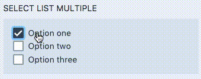
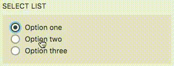

# Form field: Select

Class: `Code16\Sharp\Form\Fields\SharpFormSelectField`

## Configuration

### Constructor `function make(string $key, array $options)`

The `$options` array can be either:

- a simple key-value array
- an array of arrays with `id` and `label` keys. Fore instance:

    [
        ["id"=>1, "label"=>"Label 1"],
        ["id"=>2, "label"=>"Label 2"],
    ]

This allows to write code like this:

    SharpFormSelectField::make("travel_id",
        Travel::orderBy("departure_date")->get()->map(function($travel) {
            return [
                "id" => $travel->id,
                "label" => $travel->departure_date->format("Y-m-d")
                    . " — " . $travel->destination
            ];
        })->all()
    )

### `setMultiple(bool $multiple = true)`

Allow multi-selection (default: false)

### `setClearable(bool $clearable = true)`

Allow null value in non-multiple selection (default: false)

### `setDisplayAsList()`

Display as a list (the default value):

- radio if multiple=false
- checkboxes if multiple=true

### `setDisplayAsDropdown()`

Display as a classic dropdown.

### `setMaxSelected(int $maxSelected)`

Set a maximum item selection (multiple only).
Default: unlimited.

### `setMaxSelectedUnlimited`

Unset a maximum item selection (multiple only).

### `setInline(bool $inline = true)`

Display an inline checklist (if multiple + display=list).

### `setIdAttribute(string $idAttribute)`

Set the id name attribute of options (default: "id").

## Formatter

- `toFront`: expects
	- a single id value if multiple=false
	- an array of id values OR an array of models if multiple=true
	
- `fromFront`: returns
	- a single id value if multiple=false
	- an array of arrays with the "id" key otherwise:

    [
        ["id" => 1],
        ["id" => 2]
    ]