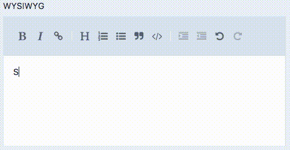

# Form field: Wysiwyg

Wysiwyg stands for What You See Is What You Get. This is therefore an HTML editor, based on [Basecamp's Trix editor](https://github.com/basecamp/trix).

Class: `Code16\Sharp\Form\Fields\SharpFormWysiwygField`




## Configuration


### `setHeight(int $height)`

Set the textarea height, in pixels.

### `showToolbar()` and `hideToolbar()`

Show or hide the toolbar (shown by default).

### `setToolbar(array $toolbar)`

Override the default toolbar, providing an array built with `SharpFormWysiwygField`'s constants:

```php
    const B = "bold";
    const I = "italic";
    const UL = "unordered-list";
    const OL = "ordered-list";
    const SEPARATOR = "|";
    const A = "link";
    const H1 = "heading-1";
    const CODE = "code";
    const QUOTE = "quote";
    const INCREASE_NESTING = "increaseNestingLevel"
    const DECREASE_NESTING = "decreaseNestingLevel"
    const UNDO = "undo";
    const REDO = "undo";
```

Example:

```php
    SharpFormWysiwygField::make("description")
            ->setToolbar([
                SharpFormWysiwygField::B,
                SharpFormWysiwygField::I,
                SharpFormWysiwygField::SEPARATOR,
                SharpFormWysiwygField::H1,
                SharpFormWysiwygField::SEPARATOR,
                SharpFormWysiwygField::A,
             ]);
```

## Formatter

- `toFront`: expects an html string.
- `fromFront`: returns a html string.