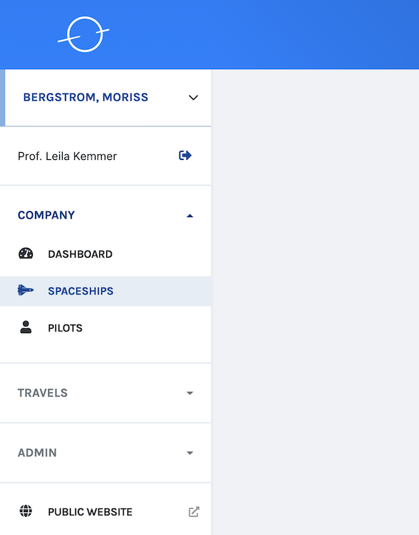
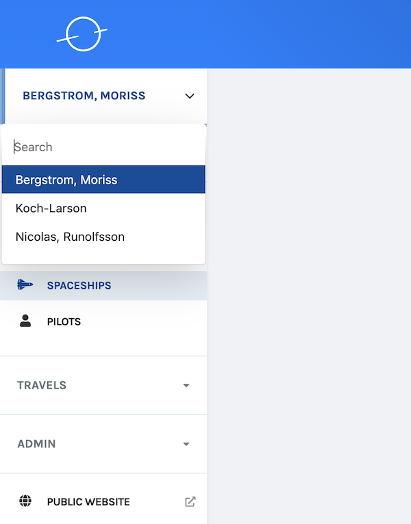

# Filters

Filters are a simple way for the user to filter list items or dashboard (see below) widgets on some attribute, for instance display only books that cost more than 15 euros.

This documentation is written for the EntityList case, but the API is the same for Dashboard (as explained at the end of this page).

## Generator

```bash
php artisan sharp:make:entity-list-filter <class_name> [--required,--multiple]
```

## Write the filter class

First, we need to write a class which extends `Code16\Sharp\EntityList\Filters\EntityListSelectFilter`, and therefore
declare a `values()` function. This function must return an `["id" => "label"]` array. For instance, with Eloquent:

```php
class SpaceshipTypeFilter extends EntityListSelectFilter
{
    public function values(): array
    {
        return SpaceshipType::orderBy("label")
            ->pluck("label", "id")
            ->toArray();
    }
}
```

## Configure the filter

You can implement the optional `buildFilterConfig()` method to configure the filter:

```php
public function buildFilterConfig(): void
{
    $this->configureLabel("Ship type")
        ->configureKey("s-type")
        ->configureRetainInSession();
}
```

- `configureLabel(string $label)`: use this to define the filter label displayed in the UI
- `configureKey(string $key)`: the default key, meaning identifier, of a filter is its class name; if you need to change
  this, you can do so with this method
- `configureRetainInSession()`: to keep the filter value in session, see below.

## Declare the filter

Next, in the EntityList, we must declare the filter:

```php
function getFilters(): ?array
{
    return [
        SpaceshipTypeFilter::class,
    ];
}
```

Sharp will display a dropdown with those values for a "type" filter.

## Handle filter selection

Once the user clicked on a filter, Sharp will call EntityList's `getListData()`; the filter value will be accessible
both with :
- classname : `$this->queryParams->filterFor(MyFilter::class)`
- key : `$this->queryParams->filterFor("key")` (this only works if it was set in the filter class with `configureKey()`)

For instance:

```php
function getListData()
{
    $spaceships = Spaceship::query();

    if($type = $this->queryParams->filterFor(SpaceshipTypeFilter::class)) {
        $spaceships->where("type_id", $type);
    }
    //or
    if($type = $this->queryParams->filterFor("s-type")) {
        $spaceships->where("type_id", $type);
    }

    [...]
}
```

## Multiple filter

First, notice that you can have as many filters as you want for an EntityList. The "multiple filter" here designate
something else: allowing the user to select more than one value for a filter. To achieve this, make your filter
extend `Code16\Sharp\EntityList\Filters\EntityListSelectMultipleFilter`.

In this case, with Eloquent for instance, your might have to modify your code to ensure that you have an array (Sharp
will return either null, and id or an array of id, depending on the user selection):

```php
function getListData()
{
    $spaceships = Spaceship::query();
    
    if ($pilots = $this->queryParams->filterFor("pilots")) {
        $spaceships->whereIn("pilots.id", (array)$pilots);
    }

    [...]
}
```

Note that a filter can't be required AND multiple.

## Date range filter

You might find useful to filter list elements on a specific date range. Date range filters enable you to show only data
that meets a given time period. To implement such a filter, your filter class must
extend `Code16\Sharp\EntityList\Filters\EntityListDateRangeFilter`.

Then you need to adjust the query with selected range (Sharp will return an associative array of two Carbon date
objects). In this case, with Eloquent for instance, you might add a condition like:

```php
function getListData()
{
    $spaceships = Spaceship::query();
    
    if ($range = $params->filterFor("createdAt")) {
        $spaceships->whereBetween(
            "created_at",
            [
                $range['start'],
                $range['end']
            ]
        );
    }
    
    [...]
}
```

### Configuration

You can define the date display format (default is `MM-DD-YYYY`, using [the Moment.js parser syntax](https://momentjs.com/docs/#/parsing/string-format/)) and choose if the week should start on monday (default is sunday) implementing those two optional methods in your filter implementation:

```php
public function buildFilterConfig(): void
{
    $this->configureDateFormat("YYYY-MM-DD")
        ->configureMondayFirst(false);
}
```

## Required filters

It is sometimes useful to have a filter which can't be null: to achieve this you need to extend the right "Required"
subclass (`EntityListSelectRequiredFilter` or `EntityListDateRangeRequiredFilter`), and define a proper default value.

Example for a select filter:

```php
class SpaceshipTypeFilter extends EntityListSelectRequiredFilter
{
    [...]
    
    public function defaultValue(): mixed
    {
        return SpaceshipType::orderBy("label")->first()->id;
    }
}
```

Note that a filter can't be required AND multiple.

Example for a date range filter:

```php
class TravelPeriodFilter extends EntityListDateRangeRequiredFilter
{
    public function defaultValue(): array
    {
        return [
            "start" => Carbon::yesterday(),
            "end" => Carbon::today(),
        ];
    }
}
```

## Filter search

If you want your select filter to be searchable via a search text field, you can use:

```php
public function buildFilterConfig(): void
{
    $this->configureSearchable();
}
```

## Filter template

Sometimes you need your select filter results to be a little more than a label. For this, configure a template (similar
to form fields with templates):

```php
public function buildFilterConfig(): void
{
    $this->configureTemplate("{{label}}<br><small>{{detail}}</small>");
}
```

You can also, for more control, return a view here.

The template will be [interpreted by Vue.js](https://vuejs.org/v2/guide/syntax.html), meaning you can add data
placeholders, DOM structure but also directives, and anything that Vue will parse. It's the same
as [Autocomplete's templates](form-fields/autocomplete.md).

You'll need also to change your `values()` function, returning more than an `["id"=>"value"]` array. For instance:

```php
public function values()
{
    return SpaceshipType::orderBy("label")
        ->get()
        ->map(function($type) {
          return [
            "id" => $type->id,
            "label" => $type=>label,
            "detail" => $type->detail_text
          ];
        });
}
```

Note that **the label attribute is mandatory**: it is used for the result display of the filter.

Finally, if your filter is also searchable, you'll need to configure attributes which should be searched in the
template:

```php
public function buildFilterConfig(): void
{
    $this->configureSearchable()
        ->configureSearchKeys(["label", "detail"]);
}
```

## Master filter

In some cases (like linked filters, for instance: the second filter values depends on the first one), you want to ensure
that selecting a filter value will reset all other filters. It's called: "master".

```php
public function buildFilterConfig(): void
{
    $this->configureMaster();
}
```

## Retained filters value in session

Sometimes you'll want to make the filter's value persistent across calls. Say for example that you have a "country" filter, which is common to several Entity Lists: the idea is to keep the user choice even when he changes the current displayed list.

```php
public function buildFilterConfig(): void
{
    $this->configureRetainInSession();
}
```

And that's it, Sharp will keep the filter value in session and ensure it is valued on next requests (if not overridden).
This feature works for all types of filters (required, multiple).

::: warning In order to make this feature work, since filters are generalized, you'll need to have unique filters key (
the filter class name by default).
:::

## Filters for Dashboards

[Dashboards](building-dashboard.md) also can take advantage of filters; the API is almost the same, except there is
obviously no Entity or Instance distinction: the only available options are `Code16\Sharp\Dashboard\DashboardFilter`
, `Code16\Sharp\Dashboard\DashboardMultipleFilter` and `Code16\Sharp\Dashboard\DashboardRequiredFilter`.

## Global menu Filters

You may want to "scope" the entire data set: an example of this could be a user which can manage several organizations
Instead of adding a filter on almost every Entity List, in this case, you can define a global filter, which will appear
like this (on the left menu):


<table>
<tr>
<td class="p-0">



</td>
<td class="p-0">



</td>
</tr>
</table>

To achieve this, first write the filter class, like any filter, except it must
extend `\Code16\Sharp\Utils\Filters\GlobalRequiredFilter` — meaning it must be a required filter.

```php
class OrganizationGlobalFilter extends GlobalRequiredFilter
{
    public function values(): array
    {
        return Corporation::orderBy("name")
            ->pluck("name", "id")
            ->all();
    }

    public function defaultValue(): mixed
    {
        return Corporation::first()->id;
    }
}
```

And then, we declare it in Sharp's config file:

```php
// sharp.php

return [
    [...]

    "global_filters" => [
        OrganizationGlobalFilter::class
    ],

    [...]
];
```

Finally, to get the actual value of the filter on your Entity List, Show Page or Form classes, you must use the context:

```php
currentSharpRequest()->globalFilterFor(OrganizationGlobalFilter::class)
```

The usage of SharpContext is [detailed here](context.md).

