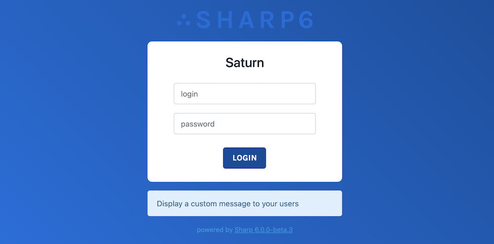

# Style & Visual Theme

### Login and menu logos

By default, the `config('sharp.name')` is displayed on the login page and on top of the menu. You can if you wish display images instead: Sharp will look for PNGs named `login-icon.png` and `menu-icon.png`, in a `/public/sharp-assets/` directory. Note that :
- `login-icon.png` is limited to 200 pixels in width and 100 pixels in height,
- and `menu-icon.png` must fit in 150 pixels in width and 50 pixels in height.

#### Display custom message on login page

You can display custom content under the form on login page. You can use it to display custom message to your users or any purpose:



You'll need to create a new template file:

```php
// resources/views/sharp/_login-page-message.blade.php

<div role="alert" class="SharpNotification SharpNotification--info">
    <div class="SharpNotification__details">
        <div class="SharpNotification__text-wrapper">
            <p class="SharpNotification__subtitle">
                Display a custom message to your users
            </p>
        </div>
    </div>
</div>
```

And then you'll need to define the path to this custom blade in the `config/sharp.php` config file:

```php
// config/sharp.php

"login_page_message_blade_path" => "sharp/_login-page-message",
```


### Injecting Assets

You may globally inject custom CSS files after the Sharp assets by defining their paths in the `config/sharp.php` config file.

```php
// config/sharp.php

"extensions" => [
   "assets" => [
      "strategy" => "raw",
      "head"     => [
         "/css/inject.css", // Outputs <link rel="stylesheet" href="/css/inject.css"> after sharp assets
      ],
   ],
],

// ...
```

The comment next to the item within the `head` position show how the output would appear in the HTML.

### Strategy

The `strategy` defines how the asset path will be rendered

- `raw` to output the path in the form it appears in your array
- `asset` to pass the path to the laravel [`asset()`](https://laravel.com/docs/5.6/helpers#method-asset) function
- `mix` to pass the path to the laravel [`mix()`](https://laravel.com/docs/5.6/helpers#method-mix) function 
